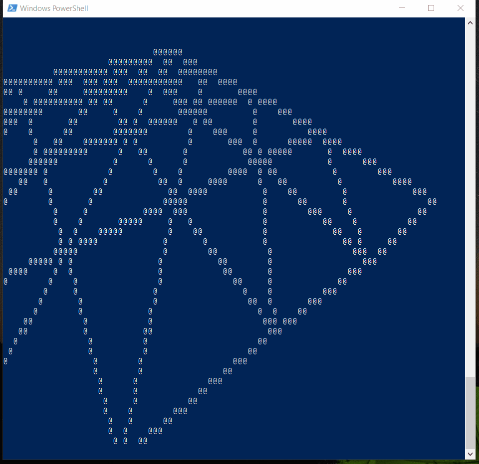

# tui
Textual user interface library for my future custom computer build needs.
Boogaloo friendly.

The point is to emulate UIs with only text as input/output
This includes: scroll views, canvas features (line drawing, etc), and some built in 3d stuff for fun.

I intend on building an entire low-tech browser, and full code editor, as well as a microprocessor operating system that utilize this.

Utilizes cglm/inlcude/cglm directory from https://github.com/recp/cglm for 3d matrix math

